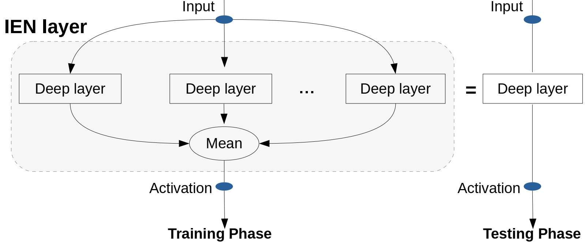

# Inner Ensemble Nets
### Abduallah Mohamed, Muhammed Mohaimin Sadiq, Ehab AlBadawy <br />
### Mohamed Elhoseiny** , Christian Claudel**
##### <sup>**</sup> Equal advising
Read full paper <a href="https://arxiv.org/abs/2006.08305">here</a> </br> </br>
We introduce Inner Ensemble Networks (IENs) which reduce the variance within the neural network itself without an increase in the model complexity.
IENs utilize ensemble parameters during the training phase to reduce the network variance. While in the testing phase, these parameters are removed without a change in the enhanced performance.
IENs reduce the variance of an ordinary deep model by a factor of , where m is the number of inner ensembles and L is the depth of the model.
Also, we show empirically and theoretically that IENs lead to a greater variance reduction in comparison with other similar approaches such as dropout and maxout.
Our results show a decrease of error rates between 1.7\% and 17.3\% in comparison with an ordinary deep model. We also extend IEN as a Neural Architecture Search cell and show it is being favorited by the search algorithms.
### IEN concept
<div align='center'>
</img>
</div>
<br />

## Using IENs 
You can have IENs installed as a pip test package using the following command: 
```bash
python3 -m pip install --index-url https://test.pypi.org/simple/ --no-deps inner-ensemble-nets==0.0.2
```

In your code import it as the following: 
```python
import ien.ien as ien
```
IEN CNN and Linear layer have the exact same signature as Pytorch nn.Conv2d and nn.Linear signatures, you can easily swap your layer as follows: 
```python 
nn.Conv2D --> ien.Conv2d_ien 
nn.Linear --> ien.Linear
```
IENs method signatures have two extra arguments: 
```python
ien.Conv2d_ien (..., m=4,init_nonlinearity='relu)
```
Where m is the number of inner ensembles, init_nonlinearity used to determine the gain for the proper initialization of an IEN layer.
Please note to apply any weight init before IENs modules been called to not override the IEN default weight init, or take care of it manually.

You can train your model as usual with no extra hassle of changing anything and benefit from the improvement in the performance using IENs.
Then, you can remove the extra ensemble weights and revert to the original model weights by executing this piece of code: 
```python
for m in model.modules():
    if hasattr(m, "domms"):
        m.domms = False
        m.apply_weights_pruning()
```

Examples will be added soon.
